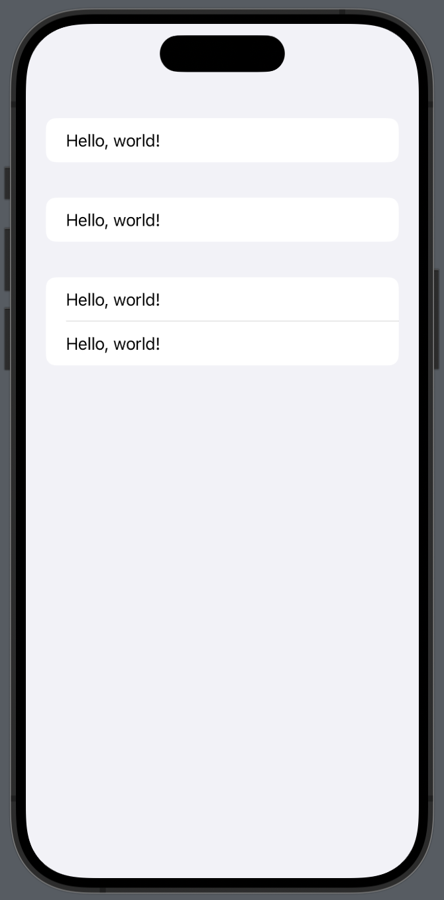
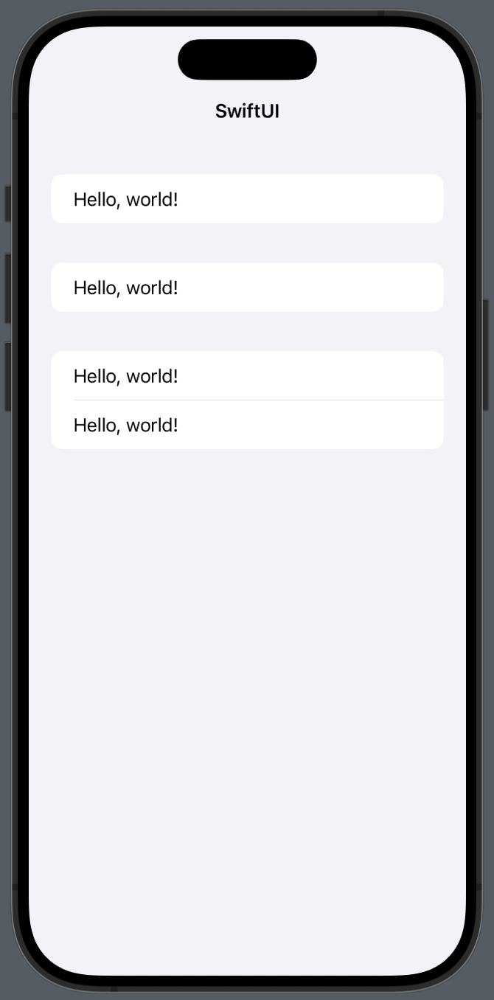
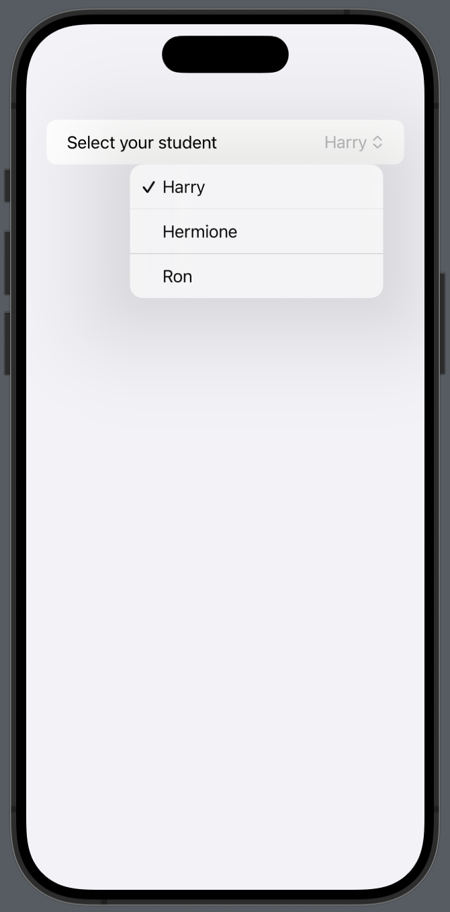

# Day16

## Basic structure

```swift
import SwiftUI

struct ContentView: View {
    var body: some View {
        VStack {
            Image(systemName: "globe")
                .imageScale(.large)
                .foregroundStyle(.tint)
            Text("Hello, world!")
        }
        .padding()
    }
}

#Preview {
    ContentView()
}
```

- `View` protocol : The basic protocol that must be adopted by anything you want to draw on the screen
- `some View` : It'll return something that conforms to the `View` protocol
- `body` : The only requirement of `View` protocol. It'll be represented on the screen
- `#Preview` : It can show a preview of your UI design alongside your code

## Form

- The scrolling list of static controls, but can also include user interactive controls. (e.g. text fields, toggle switches, buttons)
- Use `Form` to create the view.
- Use `Section` to divide in several rows.

```swift
var body: some View {
    Form {
        Text("Hello, world!")

        Section {
            Text("Hello, world!")
        }

        Section {
            Text("Hello, world!")
            Text("Hello, world!")
        }
    }
}
```



## Navigation bar

- Navigation bar has titles and buttons.
- Use `NavigationStack` to create navigation bar.
- The navigation bar doesn't show until you use `.navigationTitle()` modifier which set the navigation bar title.
- Use `.navigationBarTitleDisplayMode()` to set display mode between inline and large, or just automatic.

```swift
NavigationStack {
    Form {
        Text("Hello, world!")
        
        Section {
            Text("Hello, world!")
        }
        
        Section {
            Text("Hello, world!")
            Text("Hello, world!")
        }
    }
    .navigationTitle("SwiftUI")
    .navigationBarTitleDisplayMode(.inline)
}
```



## Modifying program state

- Interaction is determined by the state of your app.
- In your view, even the property is variable, you can't modify the value because your view(created to struct) might be created as a constant.
- Use `@State` to store program state.
- `@State` allows us to change view's variable
- Apple recommands that we use `private` access control to `@State` variable

```swift
struct ContentView: View {
    @State private var tapCount = 0
    // var tapCount = 0  // x

    var body: some View {
        Button("Tap Count: \(tapCount)") {
            self.tapCount += 1
        }
    }
}
```

## Binding state to user interface controls

- Two-way binding : Show the value of this property here, but write any changes back to the property
- Use `$` to the state property

```swift
struct ContentView: View {
    @State private var name = ""

    var body: some View {
        Form {
            TextField("Enter your name", text: $name)
            Text("Hello, world!")
        }
    }
}
```

## Creating views in a loop

- Use `ForEach` to create several views
- `students` doesn't need to be marked with `@State` because it's a constant; it isn't going to change.
- `Picker` has two-way binding to `selectedStudent`, which means it will start showing a selection of "Harry" but update the property when the user selects something else.
- In `ForEach`, `id` is able to identify every view on the screen uniquely. It can detect when things change.

```swift
struct ContentView: View {
    private let students = ["Harry", "Hermione", "Ron"]
    @State private var selectedStudent = "Harry"

    var body: some View {
        NavigationStack {
            Form {
                Picker("Select your student", selection: $selectedStudent) {
                    ForEach(students, id: \.self, content: Text.init)
                }
            }
        }
    }
}
```

