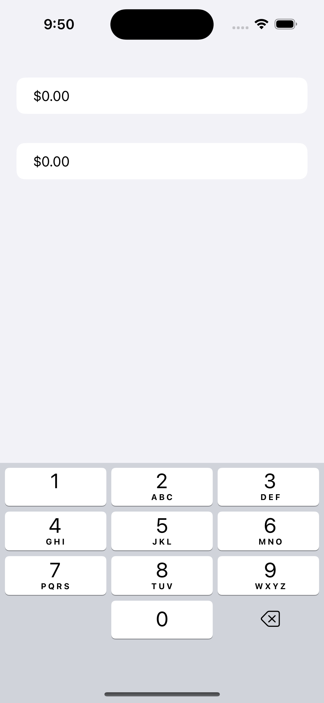
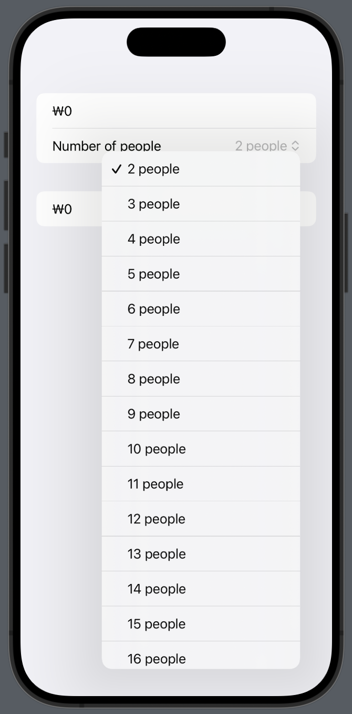
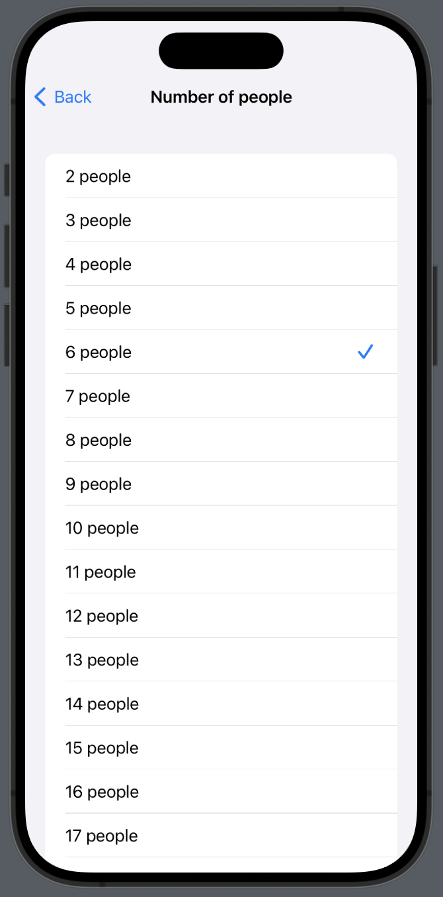
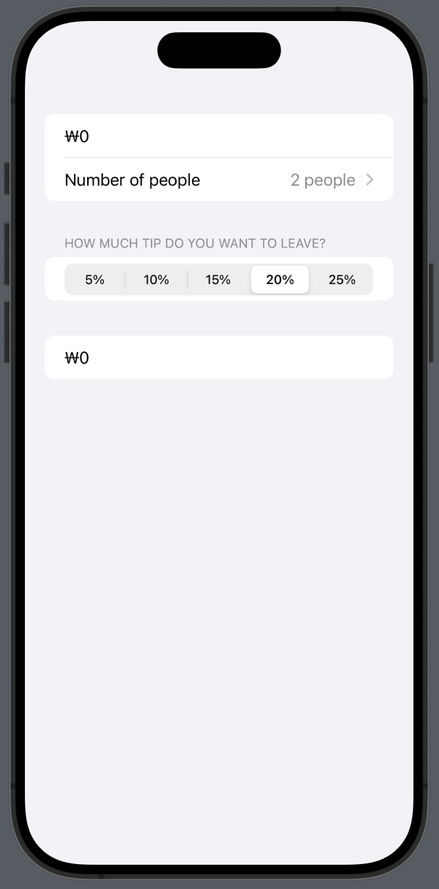
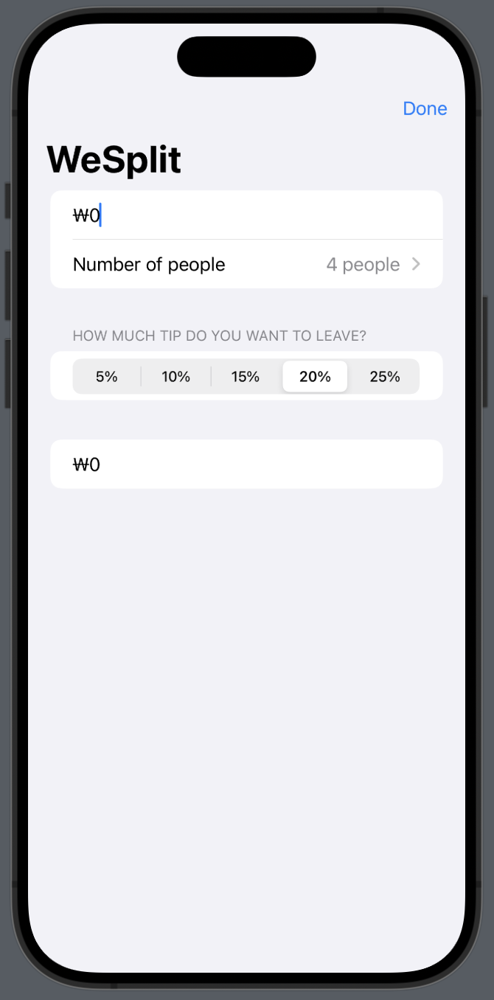

# Day17

## Reading text from the user with TextField

- Define `@State` property to bind to `TextField`.
- When the value of property marked as `@State` changes, SwiftUI will reload entire view.
- If the view is reloaded, `body` block is re-calculated with changed `@State` value.

```swift
@State private var checkAmount = 0.0

var body: some View {
    Form {
        Section {
            // Since TextField is used for entering text, you can't bind `Double` value to TextField.
            //
            // TextField("Amount", text: $checkAmount)

            // You can bind `Double` value with current format.
            TextField(
                "Amount",  // placeholder text
                text: $checkAmount,  // two-way binding
                format: .currency(code: Locale.current.currency?.identifier ?? "USD")
            )
            .keyboardType(.decimal)  // change keyboard type
        }

        Section {
            Text(
                checkAmount, 
                format: .currency(code: Locale.current.currency?.identifier ?? "USD")
            )
        }
    }
}
```

1. Type some numbers.
2. SwiftUI tracks whether the value of `checkAmount` is changed which is `@State` property.
3. Typed numbers will be stored to `checkAmount` which is the state property binds to `TextField`.
4. SwiftUI recognizes the change and reload entire view.
5. When the view is reloaded, `Text` uses changed value of `checkAmount`.
6. Finally, every time you type the number, below text will change as you type.



## Creating pickers in a form

- Picker can select several options in different ways depends on devices and styles.

```swift
@State private var numberOfPeople = 2

var body: some View  {
    Form {
        Section {
            TextField(
                "Amount", 
                value: $checkAmount, 
                format: Locale.current.currency?.identifier ?? "USD"
            )
            .keyboardType(.decimalPad)

            Picker("Number of people", selection: $numberOfPeople) {
                ForEach(2..<100) {
                    Text("\($0) people")
                }
            }
        }
    }
}
```



- Pickers com with lots alternative styles depending on how you want things to behave.
- You can select `.navigationLink` style which operates only in the `NavigationStack`.
- This style moves the user to a new screen to select their option.

```swift
Picker("Number of people", selection: $numberOfPeople) {
    ForEach(2..<100) {
        Text("\($0) people")
    }
}
.pickerStyle(.navigationLink)
```



## Adding a segmented control for tip percentages

- Use `.segment` picker style.
- Set text to section header: `Section("Section Title")`

```swift
Section("How much tip do you want to leave?") {
    Picker("Tip percentage", selection: $tipPercentage) {
        ForEach(tipPercentages, id: \.self) {
            Text($0, format: .percent)
        }
    }
    .pickerStyle(.segmented)
}
```



## Calculating the total per person

- Use computed property to calculate current amount of check for each people.

```swift
private var totalPerPerson: Double {
    let peopleCount = Double(numberOfPeople - 2)
    let tipSelection = Double(tipPercentage)
    let tip = checkAmount / 100 * tipSelection
    return (checkAmount + tip) / peopleCount
}
```

## Hiding the keyboard

- Use `@FocusState` to let know into Swift that when you focus out from a control.
- Attach the `@FocusState` to text field using `.focused()` modifier
- Use `.toolBar()` modifier to add button as a tool bar item.

```swift
Form {
    Section {
        TextField(
            "Amount",  // placeholder text
            value: $checkAmount,  // two-way binding
            format: .currency(code: Locale.current.currency?.identifier ?? "USD")
        )
        .keyboardType(.numberPad)
        .focused($amountIsFocused)
    }
    ...
}
.navigationTitle("WeSplit")
.toolbar {
    Button("Done") {
        amountIsFocused.toggle()
    }
}
```

